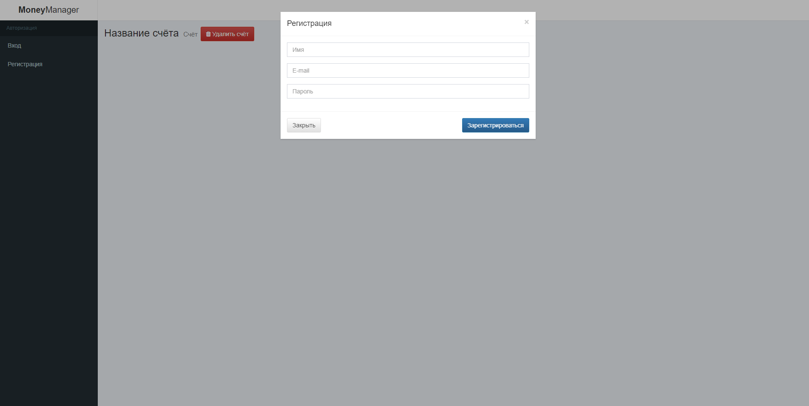
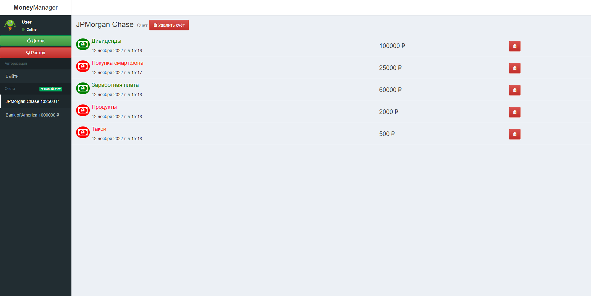
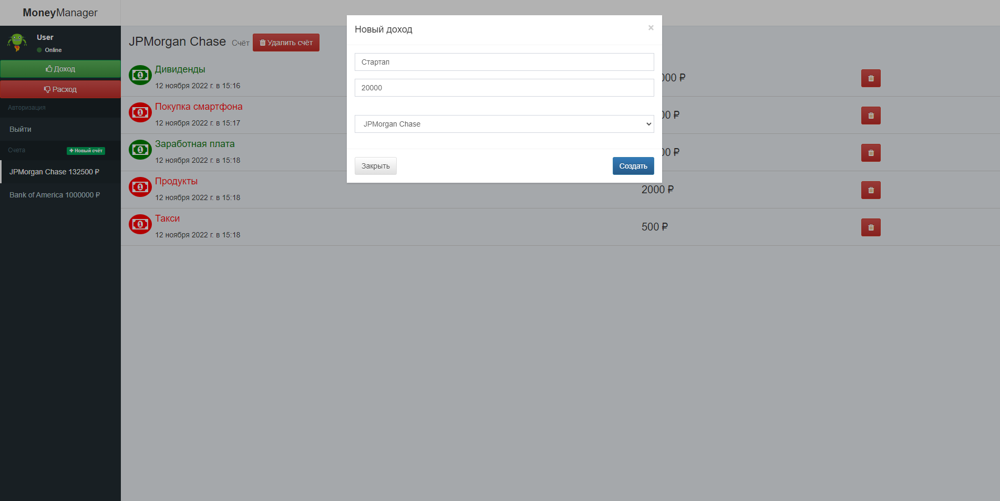
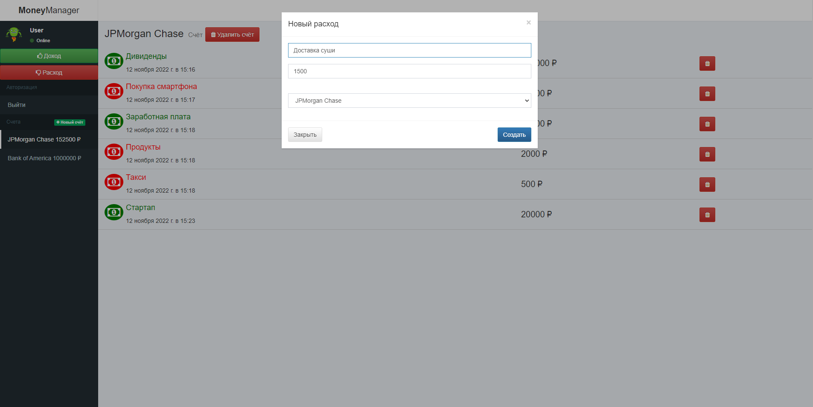

# Money Manager

## Description

**Money Manager** is a web application for _financial management_. After logging in to the application, you can create/delete accounts and add/delete and track transactions in the user's personal account. The starting code for the project execution is taken from the [repository](https://github.com/netology-code/bhj-diploma.git).

## Screenshots

<table align="center" border="0">

<tr>
<td>  </td>
<td>  </td>
</tr>

<tr>
<td>  </td>
<td>  </td>
</tr>

</table>

## Getting started

1. Clone Repository
2. `cd money-manager`
3. `npm i`
4. `npm run start`
